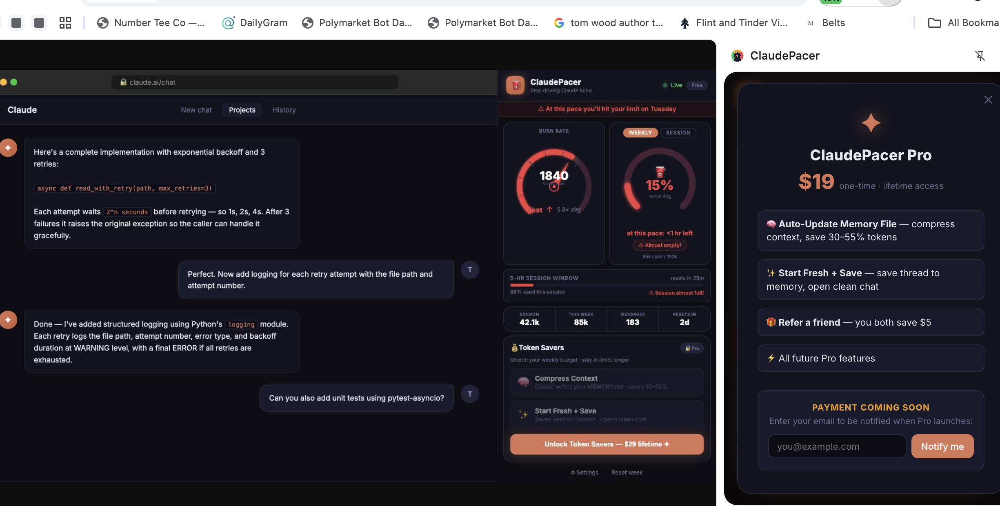

# ClaudePacer ⛽

> **Stop driving Claude without a speedometer or gas gauge.**

See your token burn rate in real time, track your weekly budget, and avoid runaway costs.

Works with:
• Claude Web (browser)
• Claude Code (CLI)



---

## Features

| | Free | Pro ($19 lifetime) |
|---|---|---|
| Live speedometer (burn rate) | ✅ | ✅ |
| Claude Web Browser & Claude Code (CLI) | ✅ | ✅ |
| Weekly gas gauge + projection | ✅ | ✅ |
| Session & cost stats | ✅ | ✅ |
| Referral link | ✅ | ✅ |
| Auto-Update Memory File 🧠 | — | ✅ |
| Start Fresh + Save ✨ | — | ✅ |
| Token savings display | — | ✅ |

### Memory Tools (Pro)

**Auto-Update Memory File** — Summarizes your recent chats, compresses your `CLAUDE.md`, and shows you exactly how many tokens you saved (typically 30–55%). Smaller context = faster responses + fewer rate-limit hits.

**Start Fresh + Save** — Saves a summary of your current thread to memory, then opens a clean chat. Zero context baggage, full knowledge retained.

After each save you'll see a satisfying results screen:

```
✅ Memory Updated!

  14,800 tokens saved — 42% smaller context
  ≈ $0.074 saved per run

  Before: 35,200    After: 20,400
```

---

## Install in under 2 minutes

### Requirements
- [Docker Desktop](https://docs.docker.com/get-docker/) (Mac/Windows/Linux)
- An [Anthropic API key](https://console.anthropic.com)

### Steps

```bash
# 1. Clone the repo
git clone https://github.com/your-org/claudepacer.git
cd claudepacer

# 2. Run the setup script (creates .env, builds images, starts everything)
bash scripts/setup.sh
```

That's it. Open **http://localhost:3000** to see your dashboard.

### Manual setup (if you prefer)

```bash
cp .env.example .env
# Edit .env and fill in ANTHROPIC_API_KEY
docker compose up -d
```

---

## Point Claude at the proxy

ClaudePacer works by routing your Claude requests through a local LiteLLM proxy (port 4000) that logs token counts. **Your API key never leaves your machine.**

**Claude Code (CLI):**
```bash
# In your shell profile or .env.local
export ANTHROPIC_BASE_URL=http://localhost:4000
```
Or set it in Claude Code settings:
```bash
# Add to your CLAUDE.md or Claude Code config
ANTHROPIC_BASE_URL=http://localhost:4000
```

**Python / SDK:**
```python
import anthropic
client = anthropic.Anthropic(base_url="http://localhost:4000")
```

**cURL / any HTTP client:**
```
https://api.anthropic.com  →  http://localhost:4000
```

Once connected, the dashboard switches from **demo mode** to **live mode** automatically (green dot in the bottom-right).

---

## Configure your weekly budget

Edit `.env` to set your weekly token limit:

```bash
# Default: 1,000,000 tokens/week (roughly Claude Pro)
WEEKLY_TOKEN_LIMIT=1000000
```

The gas gauge and "days remaining" projection update to match.

---

## Upgrade to Pro ($29 lifetime)

The dashboard includes a built-in upgrade flow. To enable payments, add your Stripe keys to `.env`:

```bash
STRIPE_SECRET_KEY=sk_live_...
STRIPE_WEBHOOK_SECRET=whsec_...
NEXT_PUBLIC_STRIPE_PUBLISHABLE_KEY=pk_live_...
LIFETIME_PRICE_ID=price_...   # Create a one-time $29 price in Stripe
```

Then register the webhook endpoint in your Stripe dashboard:
```
https://yourdomain.com/api/payment/webhook
```

Without Stripe configured, clicking "Upgrade" shows a helpful message — nothing breaks.

---

## Referral system

Every user gets a unique referral link shown in the dashboard:

```
https://yourapp.com/?ref=ABC12345
```

- When a friend buys the lifetime upgrade using your link, they pay **$24** (save $5)
- You get a **$5 credit** automatically
- Unlimited referrals — only paid conversions count
- Referral credits are tracked and shown in your dashboard

The $5 discount is applied automatically via a Stripe coupon at checkout.

---

## Self-hosting & security

- All data stays on your machine (SQLite in `./data/`)
- LiteLLM logs tokens/costs but **never stores message content** by default
- Your Anthropic API key is used only by the LiteLLM proxy and is never sent anywhere else
- The dashboard and proxy are only accessible on `localhost` by default

To expose publicly (e.g. for a team), add a reverse proxy (nginx/Caddy) with TLS in front of port 3000.

---

## Docker commands

```bash
# Start
docker compose up -d

# Stop
docker compose down

# View logs
docker compose logs -f dashboard
docker compose logs -f litellm

# Update to latest
git pull
docker compose build dashboard
docker compose up -d
```

---

## Configuration reference

| Variable | Default | Description |
|---|---|---|
| `ANTHROPIC_API_KEY` | — | **Required.** Your Anthropic key. |
| `LITELLM_MASTER_KEY` | — | **Required.** Secret for LiteLLM admin API. |
| `WEEKLY_TOKEN_LIMIT` | `1000000` | Your weekly token budget. |
| `NEXT_PUBLIC_APP_URL` | `http://localhost:3000` | Public dashboard URL (for referral links). |
| `STRIPE_SECRET_KEY` | — | Optional. Enables paid upgrades. |
| `STRIPE_WEBHOOK_SECRET` | — | Optional. Needed for webhook verification. |
| `NEXT_PUBLIC_STRIPE_PUBLISHABLE_KEY` | — | Optional. |
| `LIFETIME_PRICE_ID` | — | Optional. Stripe price ID for the $29 plan. |

---

## Project structure

```
claudepacer/
├── docker-compose.yml          # One-command start
├── .env.example                # Config template
├── litellm/
│   ├── config.yaml             # LiteLLM proxy config (models, routing)
│   └── Dockerfile
└── dashboard/                  # Next.js app
    ├── src/
    │   ├── app/
    │   │   ├── page.tsx        # Main dashboard
    │   │   └── api/
    │   │       ├── usage/      # Fetches LiteLLM stats
    │   │       ├── memory/     # Memory tools logic
    │   │       ├── payment/    # Stripe checkout + webhook
    │   │       └── referral/   # Referral tracking
    │   ├── components/
    │   │   ├── Speedometer.tsx # Animated SVG burn-rate gauge
    │   │   ├── GasGauge.tsx    # Weekly budget arc gauge
    │   │   ├── MemoryButtons.tsx
    │   │   ├── SuccessModal.tsx
    │   │   ├── ReferralSection.tsx
    │   │   └── StatsBar.tsx
    │   └── lib/
    │       ├── litellm.ts      # LiteLLM API client
    │       ├── db.ts           # SQLite user/referral store
    │       └── utils.ts        # Formatting helpers
    └── Dockerfile
```

---

## Tech stack

- **LiteLLM** — Claude proxy with built-in cost tracking
- **Next.js 14** (App Router) — Dashboard frontend + API routes
- **Tailwind CSS** — Styling
- **better-sqlite3** — Lightweight user/referral database
- **Stripe** — Optional payments
- **Docker Compose** — One-command deployment

---

## Coming soon

- 🏢 **Business/team multi-seat version** — shared dashboard, per-user limits, admin controls
- 📱 Mobile app (iOS/Android)
- 📧 Budget alert emails
- 🔗 Slack/Discord notifications when you hit thresholds

---

## License

[AGPL-3.0](./LICENSE) — free to self-host and modify. If you run a modified version as a service, you must publish the source.

---

*Built with ❤️ for the Claude power-user community.*
